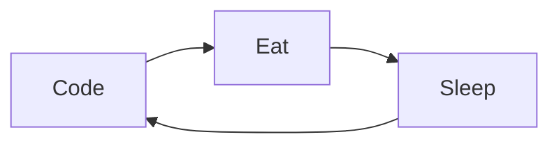

<picture>
 <source media="(prefers-color-scheme: dark)" srcset="https://media.tenor.com/LDuF2jVabwoAAAAC/banner-welcome.gif">
 <source media="(prefers-color-scheme: light)" srcset="https://t3.ftcdn.net/jpg/01/76/98/40/360_F_176984023_8I82qQPmKn8TqNAZXIYMCSiwccoUiPBg.jpg">
 
</picture>

## About me:

<!-- TO DO: add more details later. -->

My Top 3 Anime:

| Rank | Topics |
|-----:|-----------|
|     1| Bleach |
|     2| Naruto |
|     3| Attack On Titan |

---
> Shidduma !!

— ThadaDoe

<!--
**chellxh/chellxh** is a ✨ _special_ ✨ repository because its `README.md` (this file) appears on your GitHub profile.

Here are some ideas to get you started:

- 🔭 I’m currently working on ...
- 🌱 I’m currently learning ...
- 👯 I’m looking to collaborate on ...
- 🤔 I’m looking for help with ...
- 💬 Ask me about ...
- 📫 How to reach me: ...
- 😄 Pronouns: ...
- ⚡ Fun fact: ...
-->
